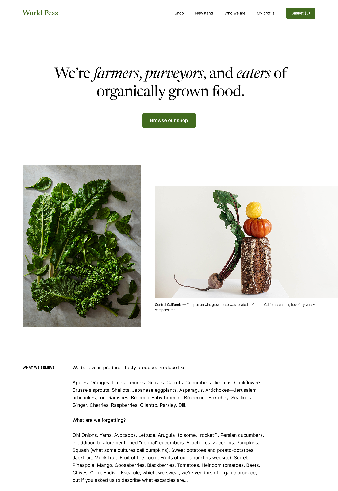
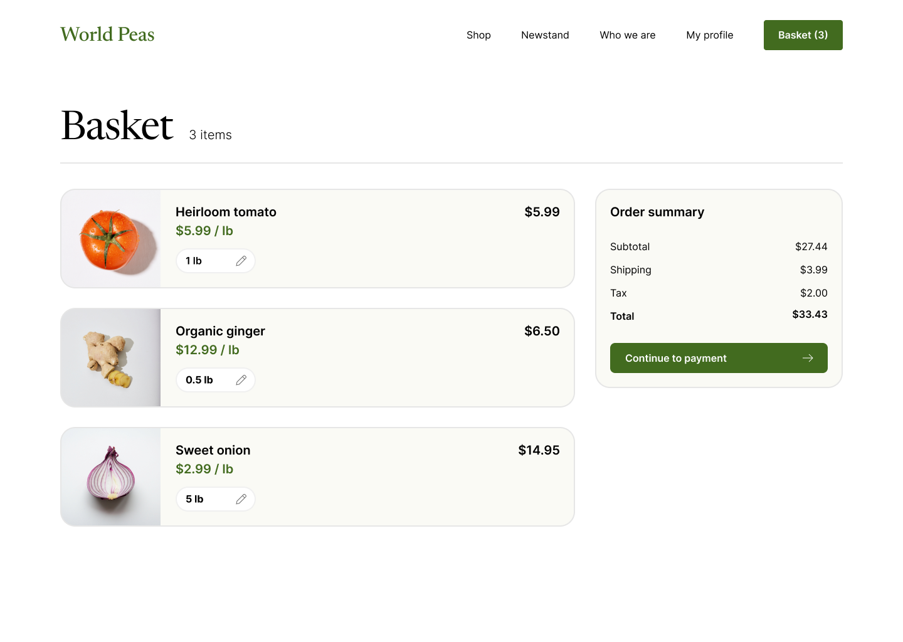
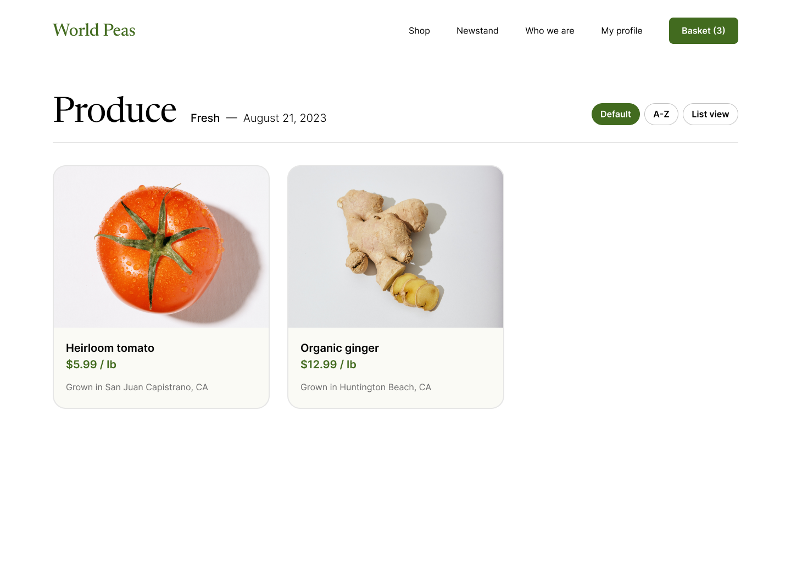

# Figma-to-Code Agent

Convert Figma designs to production-ready React/Vue components. Supports CSS Modules, Tailwind, and plain CSS.

> 📖 New here? Check the [Quick Start Guide](QUICKSTART.md) for step-by-step setup.

## Examples

### Example 1 — MIUI12 官网 (全局导航)

| Original Design | React | Vue |
|:-:|:-:|:-:|
|  |  |  |

### Example 2 — Homepage (World Peas)

| Original Design | React | Vue |
|:-:|:-:|:-:|
|  |  |  |

### Example 3 — Shopping Cart

| Original Design | React | Vue |
|:-:|:-:|:-:|
|  |  |  |

### Example 4 — Product Page

| Original Design | React | Vue |
|:-:|:-:|:-:|
|  |  |  |

## Features

- 🎨 Extract designs from Figma API with caching and rate-limit handling
- ⚛️ Generate React (.jsx/.tsx) and Vue (.vue) components
- 🎭 CSS Modules, Tailwind CSS (arbitrary values), or plain CSS with separate stylesheet
- 📐 Absolute positioning with responsive scaling (auto-fits viewport)
- 🖼️ Image export at 2x resolution, vector icon auto-detection and PNG export
- 🔤 Full typography support (font family, size, weight, line-height, letter-spacing, color)
- 👁️ Figma layer filtering (hidden layers, mask shapes)
- 🎯 Design token extraction (CSS variables, SCSS, JSON, JS)
- 🧩 Component splitting (auto-split large designs >50 nodes, max depth 4)
- 📁 File organizer (PascalCase/kebab-case naming, directory structure, Props interface)
- 🖼️ Asset management (image dedup, SVG-first, semantic naming, import generation)
- 🔍 Visual validation (Puppeteer rendering, pixel comparison, similarity scoring)
- ♿ Accessibility enhancement (ARIA roles, alt text, landmark detection)
- ⚡ Performance optimization (lazy loading, code splitting hints, redundant wrapper removal)
- 🎨 Style deduplication (merge identical CSS rules across components)
- 📱 Responsive code generation (media queries from breakpoint metadata)
- 🤖 Optional AI enhancements (semantic naming, component splitting, code optimization)

## Install

```bash
npm install -g figma-to-code-agent
```

Or use directly with npx (no install needed):

```bash
npx figma-to-code-agent --token YOUR_FIGMA_TOKEN --file FILE_KEY --node NODE_ID --output ./output
```

## Quick Start

```bash
# Generate React component
npx figma-to-code-agent \
  --token YOUR_FIGMA_TOKEN \
  --file FILE_KEY \
  --node NODE_ID \
  --framework react \
  --output ./output

# Generate and preview in browser
npx figma-to-code-agent \
  --token YOUR_FIGMA_TOKEN \
  --file FILE_KEY \
  --node NODE_ID \
  --framework react \
  --output ./output \
  --preview
```

## How It Works

1. Fetches the Figma file data via API (with local caching)
2. Parses the design tree into an intermediate AST
3. Filters invisible layers, mask shapes, and transparent fills
4. Applies transformation pipeline (flatten, extract components, optimize layout, semantic naming, style merging, accessibility, performance)
5. Detects vector-only containers and exports them as PNG icons
6. Downloads images at 2x resolution
7. Generates framework-specific components with chosen style mode
8. Deduplicates identical CSS rules and generates responsive media queries
9. Wraps output in a responsive scale container (no horizontal scrollbar)

## CLI Options

| Option | Description | Default |
|--------|-------------|---------|
| `--token <token>` | Figma API token (or `FIGMA_TOKEN` env) | — |
| `--file <key>` | Figma file key | — |
| `--node <id>` | Target node ID (e.g. `1502-102`) | root |
| `--framework` | `react` or `vue` | `react` |
| `--style` | `css-modules`, `tailwind`, or `css` | `css-modules` |
| `--typescript` | Enable TypeScript output | `false` |
| `--output <dir>` | Output directory | `./output` |
| `--extract-tokens <fmt>` | Extract design tokens: `css`, `scss`, `json`, `js` | — |
| `--preview` | Preview in browser after generation | — |

### AI Options (optional)

| Option | Description |
|--------|-------------|
| `--llm-provider` | `bedrock`, `openai`, or `anthropic` |
| `--llm-model` | Model name |
| `--llm-region` | AWS region for Bedrock (default: `us-east-1`) |
| `--llm-api-key` | API key for OpenAI/Anthropic (or `LLM_API_KEY` env) |
| `--ai-naming` | AI-powered semantic component naming |
| `--ai-splitting` | AI-powered component splitting |
| `--ai-optimization` | AI-powered code optimization |
| `--ai-layout` | AI-powered layout analysis |

## Programmatic API

```typescript
import { FigmaToCodeAgent } from 'figma-to-code-agent'

const agent = new FigmaToCodeAgent({
  figmaToken: 'your-token',
  fileKey: 'your-file-key',
  framework: 'react',
  styleMode: 'css-modules',
  typescript: false,
  outputDir: './output',
  extractTokens: 'css', // optional: 'css' | 'scss' | 'json' | 'js'
})

const files = await agent.convert()
```

## Project Structure

```
src/
├── extraction/          # Figma API client, MCP protocol, caching
├── transformation/      # AST parsing, layout optimization, transformers
│   └── transformers/    # Flatten, component extraction, semantic naming,
│                        # style merger, responsive merger, accessibility,
│                        # performance optimizer, AI-powered transformers
├── generation/          # React and Vue code generators, file organizer
├── tokens/              # Design token extraction and export
├── assets/              # Asset management (image extraction, dedup)
├── validation/          # Visual validation (Puppeteer, pixel comparison)
├── config/              # Configuration management
├── errors/              # Error handling and recovery
├── llm/                 # LLM providers (Bedrock, OpenAI)
└── cli.ts               # CLI entry point
```

## Development

```bash
git clone https://github.com/lewiscutey/figma-to-code-agent.git
cd figma-to-code-agent
npm install
npm run build        # Compile TypeScript
npm test             # Run all tests (222 tests)
npm run lint         # ESLint
npm run format       # Prettier
```

## Requirements

- Node.js 18+
- npm

## License

MIT
