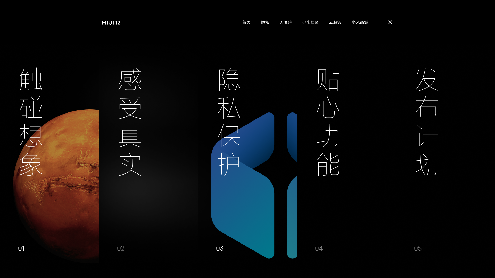
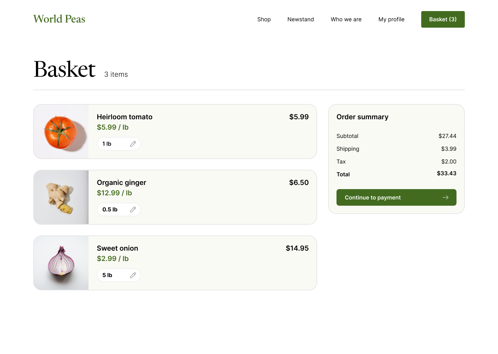

# Figma-to-Code Agent

将 Figma 设计转换为生产就绪的 React/Vue 组件。支持 CSS Modules、Tailwind 和纯 CSS。

> 📖 新手入门？查看 [快速入门指南](QUICKSTART.md) 获取详细步骤。
> 
> [English](README.md) | 中文

## 使用方式

### 1. 命令行工具（CLI）
适合本地开发和 CI/CD 集成。

```bash
npx figma-to-code-agent --token YOUR_TOKEN --file FILE_KEY --framework react --output ./output
```

[完整 CLI 指南 →](docs/CLI_GUIDE.md)

### 2. MCP 服务
集成到 Claude Desktop 或 Kiro IDE，通过 AI 对话生成代码。

[MCP 配置指南 →](docs/MCP_GUIDE.md)

### 3. Kiro Skill
在 Kiro IDE 中作为 Skill 使用，提供无缝的设计到代码工作流。

[Kiro Skill 指南 →](docs/KIRO_SKILL_GUIDE.md)

## 示例展示

### 示例 1 — MIUI12 官网（全局导航）

| 原始设计 | React | Vue |
|:-:|:-:|:-:|
|  |  |  |

### 示例 2 — 主页（World Peas）

| 原始设计 | React | Vue |
|:-:|:-:|:-:|
|  |  |  |

### 示例 3 — 购物车

| 原始设计 | React | Vue |
|:-:|:-:|:-:|
|  |  |  |

### 示例 4 — 产品页面

| 原始设计 | React | Vue |
|:-:|:-:|:-:|
|  |  |  |

## 功能特性

- 🎨 从 Figma API 提取设计，支持缓存和速率限制处理
- ⚛️ 生成 React (.jsx/.tsx) 和 Vue (.vue) 组件
- 🎭 支持 CSS Modules、Tailwind CSS 和纯 CSS
- 📐 响应式布局，自适应视口
- 🖼️ 2x 分辨率图片导出，自动检测矢量图标
- 🎯 设计令牌提取（CSS 变量、SCSS、JSON、JS）
- ♿ 无障碍增强（ARIA 角色、alt 文本）
- ⚡ 性能优化（懒加载、代码分割、样式去重）
- 🤖 可选 AI 增强（语义命名、组件拆分、代码优化）
- 🔌 MCP 服务器（集成到 Claude Desktop / Kiro IDE）
- 🎯 Kiro Skill（在 Kiro IDE 中作为技能使用）
- 📊 设计一致性检查器
- 🎮 交互原型生成器

## 安装

### 全局安装
```bash
npm install -g figma-to-code-agent
```

### 本地安装
```bash
npm install figma-to-code-agent
```

### 使用 npx（无需安装）
```bash
npx figma-to-code-agent --token YOUR_TOKEN --file FILE_KEY --output ./output
```

## 快速开始

```bash
# 生成 React 组件
npx figma-to-code-agent \
  --token YOUR_FIGMA_TOKEN \
  --file FILE_KEY \
  --node NODE_ID \
  --framework react \
  --output ./output

# 生成并预览
npx figma-to-code-agent \
  --token YOUR_FIGMA_TOKEN \
  --file FILE_KEY \
  --framework react \
  --output ./output \
  --preview
```

更多使用方式请查看 [快速入门指南](QUICKSTART.md)。

## 工作原理

1. **提取**：通过 Figma API 获取设计数据（支持缓存）
2. **解析**：将设计树解析为中间 AST
3. **转换**：应用转换管道（扁平化、组件提取、优化、语义命名）
4. **生成**：生成框架特定的组件代码
5. **优化**：样式去重、响应式处理、无障碍增强

详细架构请参考 [系统架构文档](spec/ARCHITECTURE.md)。

## CLI 选项

| 选项 | 描述 | 默认值 |
|--------|-------------|---------|
| `--token <token>` | Figma API 令牌 | — |
| `--file <key>` | Figma 文件 Key | — |
| `--node <id>` | 目标节点 ID | root |
| `--framework` | `react` 或 `vue` | `react` |
| `--style` | `css-modules`、`tailwind` 或 `css` | `css-modules` |
| `--typescript` | 启用 TypeScript | `false` |
| `--output <dir>` | 输出目录 | `./output` |
| `--preview` | 生成后在浏览器中预览 | — |
| `--mcp` | 启动 MCP 服务器模式 | — |

### AI 选项

| 选项 | 描述 |
|--------|-------------|
| `--llm-provider` | `bedrock`、`openai` 或 `anthropic` |
| `--llm-model` | 模型名称 |
| `--ai-naming` | AI 驱动的语义命名 |
| `--ai-optimization` | AI 驱动的代码优化 |

完整选项请参考 [CLI 使用指南](docs/CLI_GUIDE.md)。

## 文档

- 📖 [快速入门](QUICKSTART.md) - 5 分钟快速上手
- 🖥️ [CLI 指南](docs/CLI_GUIDE.md) - 命令行完整参考
- 🔌 [MCP 指南](docs/MCP_GUIDE.md) - 集成到 Claude/Kiro
- 🎯 [Kiro Skill 指南](docs/KIRO_SKILL_GUIDE.md) - Kiro IDE 使用
- 🏗️ [系统架构](spec/ARCHITECTURE.md) - 架构设计
- 🎨 [示例项目](assets/) - 真实转换示例

## 开发

```bash
git clone https://github.com/lewiscutey/figma-to-code-agent.git
cd figma-to-code-agent
npm install
npm run build        # 编译 TypeScript
npm test             # 运行测试（222 个测试）
npm run lint         # 代码检查
```

## 系统要求

- Node.js 18+
- Figma 访问令牌（[获取令牌](https://www.figma.com/developers/api#access-tokens)）

## 许可证

MIT License - 详见 [LICENSE](LICENSE) 文件
